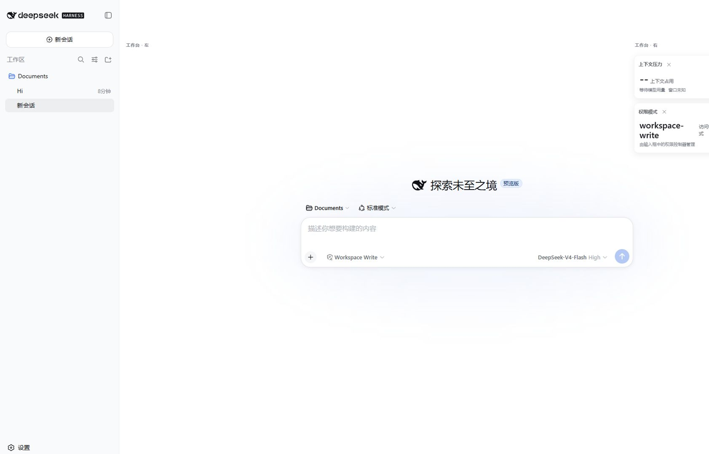
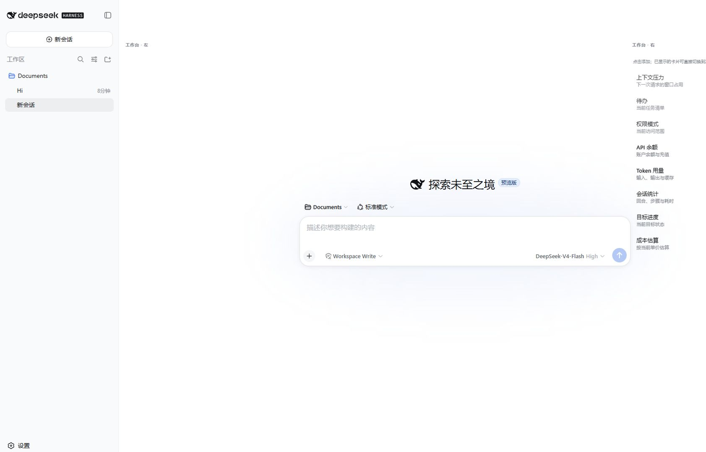

# 🐋 widget-dock · DSH 小组件面板

> DeepSeek Harness (dsh) 客户端插件：在对话页右侧提供安静的工作状态栏与可定制工作台。
>
> Widget dock plugin for DeepSeek Harness — keep API balance, token usage, session stats, goal progress and cost estimates in one focused workbench.

[](https://github.com/MorGogh/widget-dock/stargazers)
[](LICENSE)
[](https://github.com/topics/dsh-plugin)
[](https://github.com/MorGogh/widget-dock/releases)

---

## 🖼️ 效果预览 / Preview

| 工作台（对话页右侧） | 添加面板 |
|---|---|
|  |  |

## ✨ 功能 / Features

- **双侧工作台**：卡片只使用对话两侧的空白区；空间够时自动横向并排，更多卡片自动分配到另一侧
- **整理模式**：点击右侧标题栏的 `⠿` 后，可拖动卡片调整同侧顺序或移到另一侧；平时布局锁定，避免误触
- **窄窗口与轨迹**：空间不足或切换到「轨迹」时，工作台缩成贴边标签，不遮挡正文或轨迹内容
- **按需定制**：可固定余额、Token、会话统计、目标和成本估算；不需要拖动、缩放或布局管理
- **组件编辑**：余额可改 API Key，成本可改单价
- **持久化**：所选项目和配置存入 localStorage，重启保留

- **Dual-side workbench**: cards use only the blank space beside the conversation; wide windows lay out horizontally, more cards flow to the other side automatically
- **Arrange mode**: click `⠿` in the right title bar to drag cards between/within sides; layout stays locked otherwise to avoid mis-taps
- **Narrow window & trajectory**: the workbench collapses to an edge tab when space is tight or the Trajectory view is active
- **On-demand widgets**: pin balance, tokens, session stats, goal and cost estimates; no drag/resize/layout management needed
- **Editable widgets**: edit your API Key in the balance card, adjust per-unit cost in the cost card
- **Persistent**: your layout and configuration survive restarts via localStorage

## 🧩 内置小组件 / Widgets

| 图标 | 组件 | 数据来源 |
|---|---|---|
| 💰 | API 余额 | DeepSeek `user/balance` 接口（含充值跳转、KEY 编辑）|
| 📊 | Token 用量 | `tokenUsage` 投影（输入/输出/缓存）|
| 📈 | 会话统计 | `sessionStats` 投影（回合/步骤/耗时）|
| 🎯 | 目标进度 | `goal` 投影 |
| 🧾 | 成本估算 | token × 单价（单价可编辑）|

## 🚀 快速开始 / Quick Start

```bash
# 1. 把插件目录链接进 web profile 的 node_modules
mkdir -p ~/.dsh/profiles/web/node_modules
ln -sfn "$(pwd)" ~/.dsh/profiles/web/node_modules/widget-dock

# 2. 在 ~/.dsh/profiles/web/cordis.patch.yml 追加：
# - insert:
#     - id: widget-dock
#       name: 'widget-dock'

# 3. 重启 dsh web
dsh web
```

重启后：右侧出现 **工作台**。在足够宽的窗口中，卡片会自动使用左右空白区；标题栏的 `—` 可手动最小化。

> 安装遇到问题？可在 [Issues](https://github.com/MorGogh/widget-dock/issues) 提问，或查看下方 FAQ。

## 🔧 配置 / Configuration

- 余额组件**不内置密钥**：首次使用在组件内点击"KEY 编辑"填入 DeepSeek API Key（存 localStorage，仅本机）
- 成本估算单价默认：输入 ¥2 / 缓存读 ¥0.5 / 缓存写 ¥2 / 输出 ¥8（每百万 tokens，可在组件内编辑；价格以 DeepSeek 官方为准）

## ❓ 常见问题 / FAQ

**Q：打开后右侧没有工作台？**
A：确认已重启 `dsh web`，并在宽窗口下查看；空间不足时工作台会缩成贴边标签，点击标题栏即可展开。

**Q：余额显示不出来？**
A：余额组件需要 DeepSeek API Key，点击组件内「KEY 编辑」填入后刷新。

**Q：布局会被重置吗？**
A：不会，布局与配置保存在浏览器 localStorage 中，重启后保留。

**Q：支持 TUI / 其他平台吗？**
A：当前为 Web 客户端插件（`dsh.client`，platform: web）。TUI 支持在规划中，欢迎 PR。

## 📄 协议 / License

MIT

## 💝 赞助支持 / Sponsor

如果 widget-dock 对你有帮助，欢迎扫码打赏支持开发维护，感谢每一位支持者！

| 微信赞赏 | 支付宝赞赏 |
|---|---|
|  |  |
